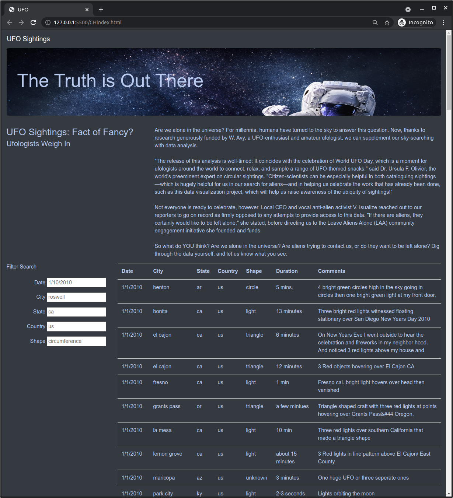

# UFO
### The journey of JavaScript

"Are we alone in the universe? For millennia, humans have turned to the sky to answer this question. Now, thanks to research generously funded by W. Avy, a UFO-enthusiast and amateur ufologist, we can supplement our sky-searching with data analysis."

What a great topic to read and to use for a JavaScript coding.

---------------------------------------------------------------------

## About the information and the code

The data was provided into a ".js file" already structured and clean.
The data is the result of some queries around the world wide web regarding the topic.

It was necesary to create the CHapp.js to create the content table.
By following the coding rules and with the help of D3 libraries it was possible to link the Data file to a results table that can be filtered using their series.

This is the result:

---------------------------------------------------------------------

## Use of Live Server

HTML coding is simplified at the time all the modifications are made and expose in real time in the console and browser chosen.
Live Server is an extension of Visual Studio that connects the coding file to the browser in the local machine.

Then, making changes in every single file that the HTML one is pointing can be reflected also automatically to the webpage.

The main discussion is around D3 and how to make the references among files.
The folders structure is also important as the webpage planning.

